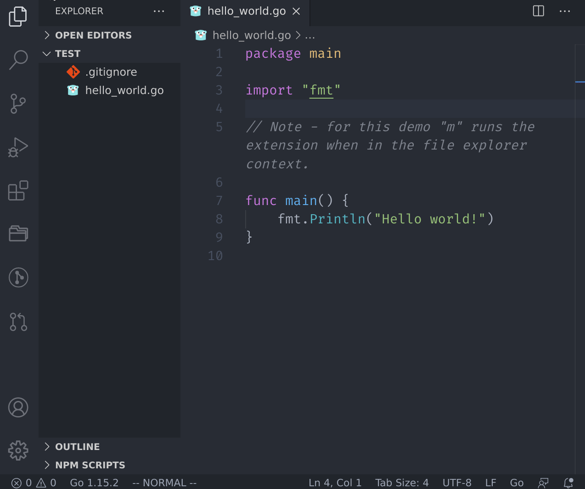

# VSCode File Explorer Menu

This extension attempts to mimic the menu from the Vim [NERDTree](https://github.com/preservim/nerdtree) plugin.

The extension includes one command `vscodeFileExplorerMenu.openFileExplorerMenu` which can be executed through the normal command menu, but for convenience(and to mimic NERDTree) it's bound to the `m` key with the `explorerViewletVisible && filesExplorerFocus && !inputFocus` when clause.

## Features

Just like the NERDTree Vim Plugin, this extension enables you to quickly:

* Add a node.
* Delete a node.
* Move a node.
* Copy a node.
* Open a node in the system editor.
* List out a node (i.e. `ls -ld`).
* Copy the node's path to the clipboard.
* Open the node in the system's file explorer.

Note - while the extension is made to work primarily through the context in the file explorer menu, if you call it from an editor it will assume the context is the file currently being edited. 

## Extension Settings

This extension contributes the following settings:

* `fileExplorerMenu.confirmFolderDeletion`: An extra prompt for deleting a folder (default is true).
* `fileExplorerMenu.displayListNodeInTerminal`: Displays the output of list node in a terminal instead of a notification (default is false).

## Known Issues

* The way the extension gets the current file path is using the `copyFilePath` command. The extension saves the contents of the clipboard before running this command and then puts it back, but if you use a clipboard manager of some kind you may see a extra entries after running one of the extension's commands. I used this hack for two reasons: 1) I time boxed myself while trying to figure out how to do this and ran out of time and 2) I don't use a clipboard manager of any kind so I didn't mind this approach. If there's a proper way to do this without the clipboard hackery, please let me know.

## Release Notes

### 1.0.2

* Fixed bug where adding a node when a folder was selected resulted in the base path being the folder's parent.

### 1.0.1

* Fixed list node so it works on Windows.

### 1.0.0

Initial release of the plugin.
